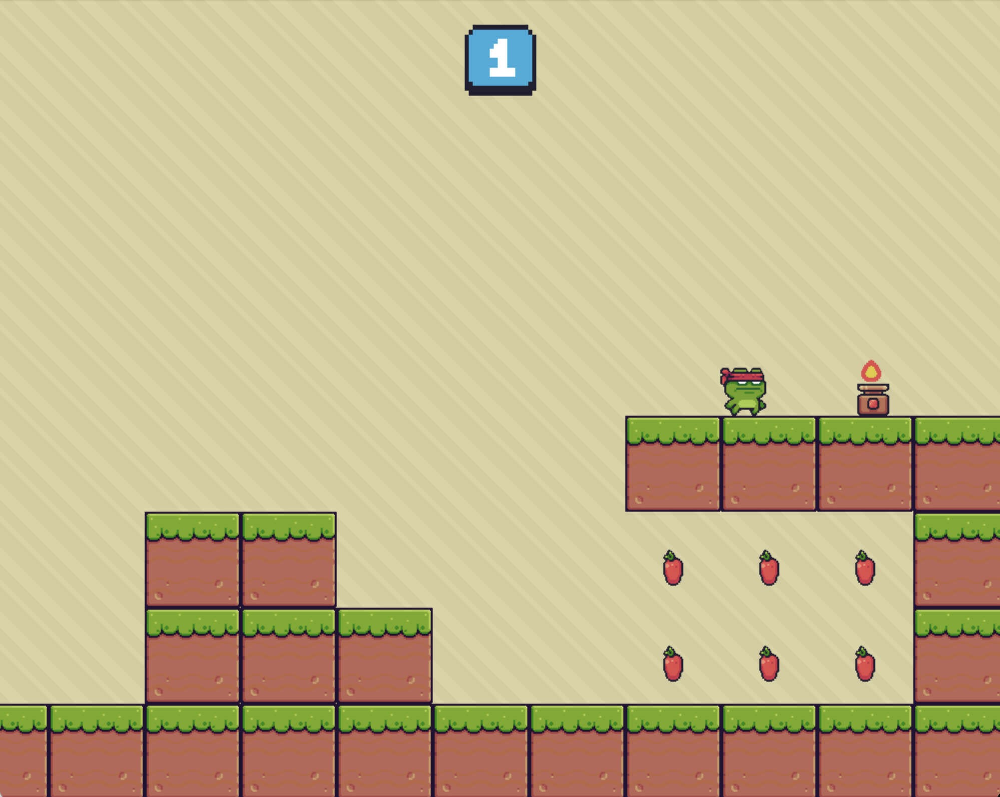

# Ninja Frog

A retro-style 2D platformer built with Python and Pygame.



---

## 🎮 Features

- 🎨 Pixel-art style visuals
- 🍏 Collectible animated fruits (5 points each)
- 🔥 Fire traps that deal damage
- 🏁 Checkpoint to complete the level
- 👟 Double jump mechanics
- 🎵 Sound effects on events
- 📜 Score display (top-left of the screen)

---

## 🚀 How to Run the Game

### ✅ Requirements

- Python 3.7 or above
- Pygame library

### 🔧 Step-by-Step Setup

1. **Install Python**

   - Download from the official site: https://www.python.org/downloads/
   - During installation, make sure to check **"Add Python to PATH"**
   - To verify installation, open a terminal and type:

     ```bash
     python --version
     ```

2. **Install Pygame**

   Open a terminal or command prompt and run:

   ```bash
   pip install pygame

